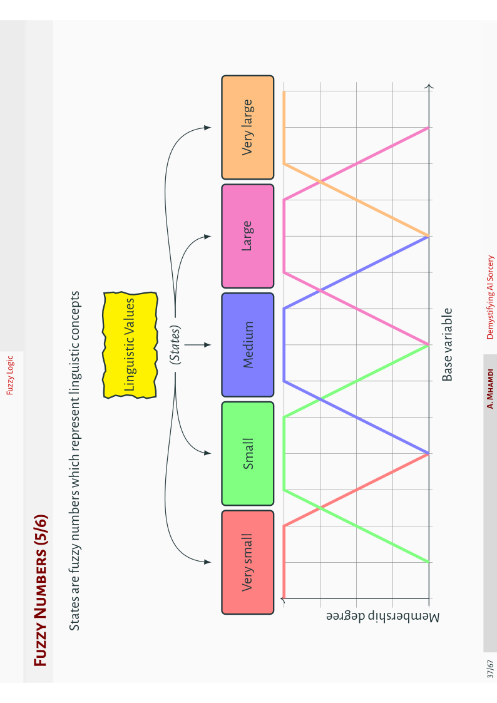
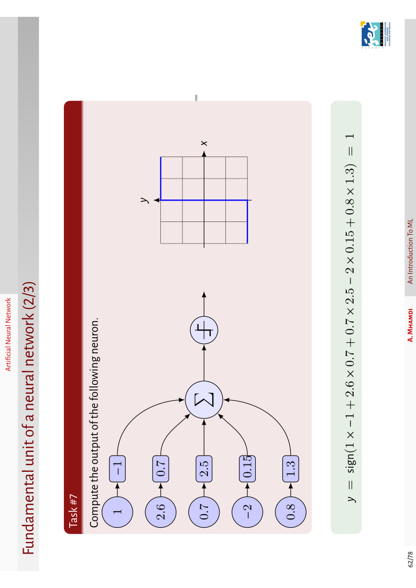
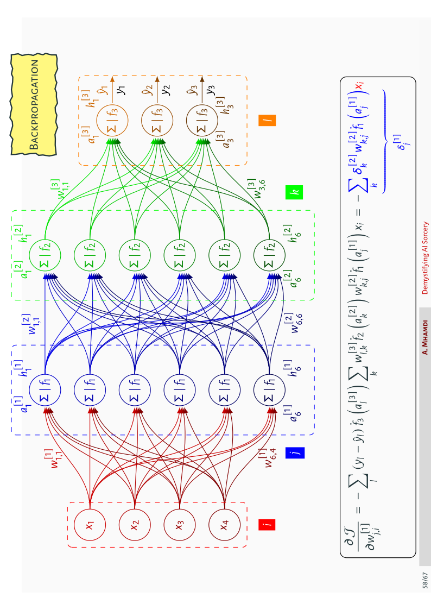
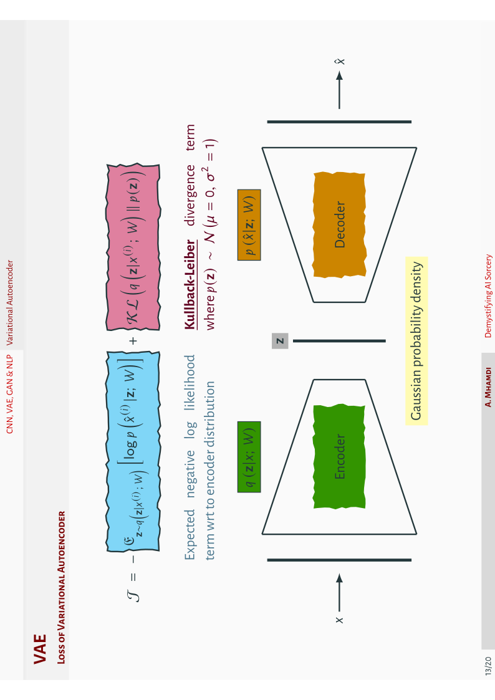
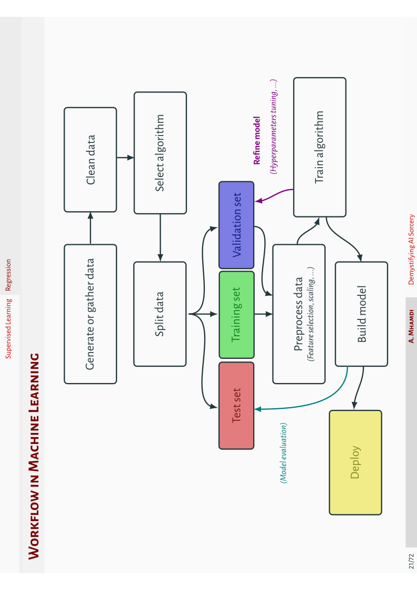
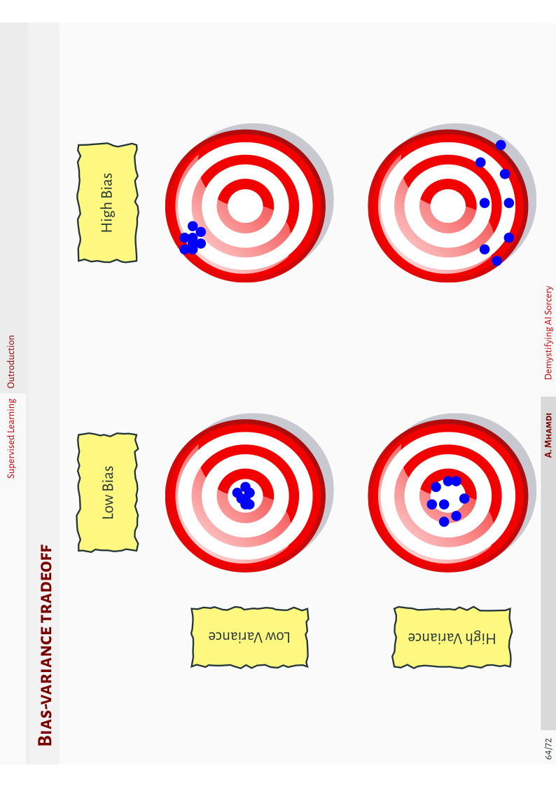
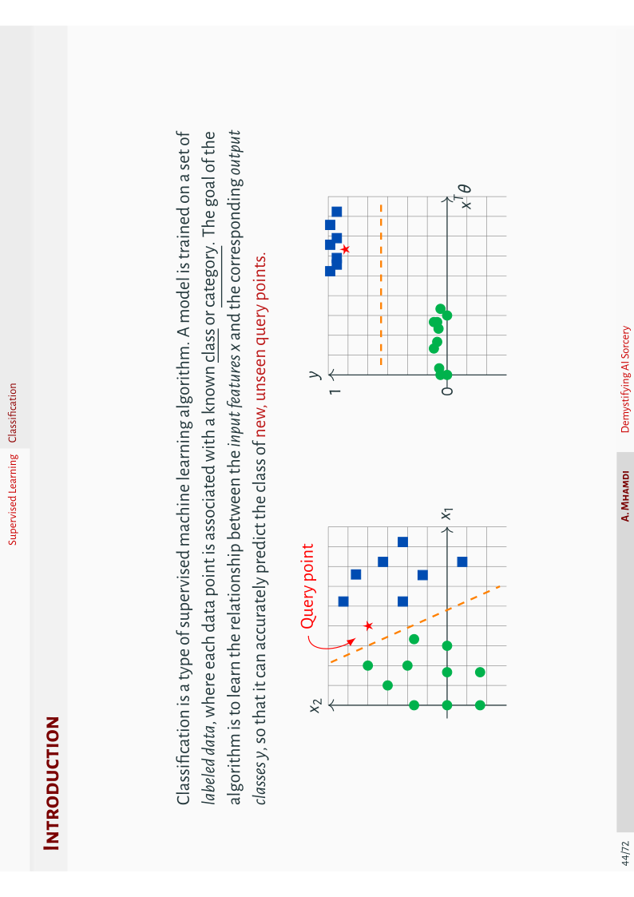

# A portfolio of some of my artworks

I share here some heterogeneous collection of screenshots of drawings I did using `LaTeX`. I hope you find it worth checking. As they do not belong to the same project, please, raise an issue (I suggest you label it as the image file name) if you want the snippet code for any specific graphic.

** TO-DO: **

- [x] SVG Screenshots for higher resolution;
- [ ] MWE for every file in this repository.

 

